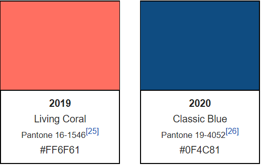

##### written by Elise Plecnik

### A brief history

Pantone, Inc.'s humble beginnings began as a small business that manufactured cosmetic cards in Manoochie, New Jersey in the 1950s. At the time, there existed no industry-wide or uniform standards for color printing. Lawrence Herbert joined Pantone as part-time staff in 1956 where he worked as a color matcher. 

Herbert had his sights set in pursuing a professional career as a physician. Herbert became so intrigued with his work at Pantone, he scrapped the idea of being a physician altogether. In 1962, Herbert purchased Pantone. Within one year, Herbert propelled Pantone to its reputation as the international authority on color systems through his invention of the Pantone® Matching System®. 

Today, Pantone is known for building a universal standard for global communication of color in the printing, publishing, packaging, graphic arts, paint, plastics, coatings, computer, film, video, textile and fashion industries.

### Pantone's Color of the Year

Pantone's "Color of the Year" began 2000 through the [Pantone Color Institute](https://www.pantone.com/color-consulting/about-pantone-color-institute). According to its Wikipedia page,

> Twice a year the company hosts, in a European capital, a secret meeting of representatives from various nations' color standards groups. After two days of presentations and debate, they choose a color for the following year; for example, the color for summer 2013 was chosen in London in the spring of 2012.

So what was the Pantone Color of the Year for each consecutive year? 
A table and images of color cards for review is found below. For the record, year 2016 is the only year (thus far), for which there were two winning Pantone Color of the Year. 2016 must have been a year of debate! 

|Year|Name            |Pantone Color        |HexCode    |
|:--:|:--------------:|:-------------------:|:---------:|
|2000|Cerulean        |`Pantone 15-4020`    |``#9BB7D4``|
|2001|Fuchsia Rose    |`Pantone 17-2031`    |``#C74375``|
|2002|True Red        |`Pantone 19-1664`    |``#BF1932``|
|2003|Aqua Sky        |`Pantone 14-4811`    |``#7BC4C4``|
|2004|Tigerlily       |`Pantone 17-1456`    |``#E2583E``|
|2005|Blue Turquoise  |`Pantone 15-5217`    |``#53B0AE``|
|2006|Sand Dollar     |`Pantone 13-1106`    |``#DECDBE``|
|2007|Chili Pepper    |`Pantone 19-1557`    |``#9B1B30``|
|2008|Blue Iris       |`Pantone 18-3943`    |``#5A5B9F``|
|2009|Mimosa          |`Pantone 14-0848`    |``#F0C05A``|
|2010|Turquoise       |`Pantone 15-5519`    |``#45B5AA``|
|2011|Honeysuckle     |`Pantone 18-2120`    |``#D94F70``|
|2012|Tangerine Tango |`Pantone 17-1463[19]`|``#DD4124``|
|2013|Emerald         |`Pantone 17-5641`    |``#009473``|
|2014|Radiant Orchid  |`Pantone 18-3224[20]`|``#B163A3``|
|2015|Marsala         |`Pantone 18-1438[21]`|``#955251``|
|2016|Rose Quartz     |`Pantone 13-1520[22]`|``#F7CAC9``|
|2016|Serenity        |`Pantone 15-3913[22]`|``#92A8D1``|
|2017|Greenery        |`Pantone 15-0343[23]`|``#88B04B``|
|2018|Ultra Violet    |`Pantone 18-3838[24]`|``#5F4B8B``|
|2019|Living Coral    |`Pantone 16-1546[25]`|``#FF6F61``|
|2020|Classic Blue    |`Pantone 19-4052[26]`|``#0F4C81``|

This and next year's colors are:

Want to discuss all things Pantone with Elise Plečnik? Send her an [email](mailto:elise@elisejane.me?subject=Pantone)!